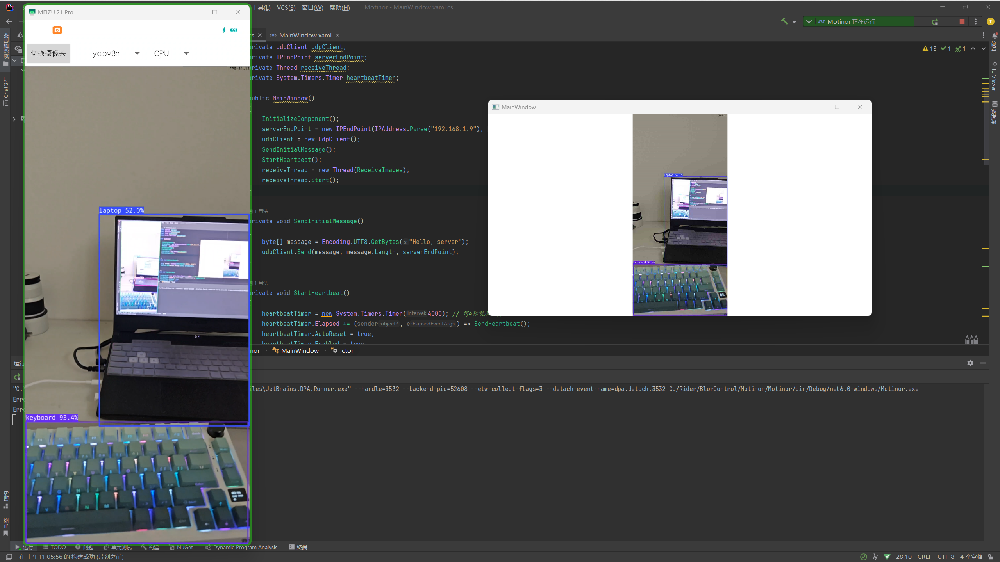
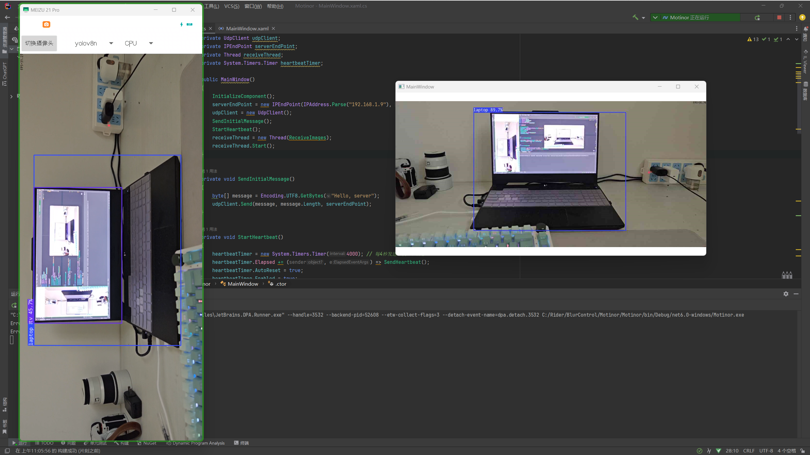

# MobileMonitor

Old mobile phone for monitoring

# 旧手机改监控

实现了YOLOV8的物体检测，使用**UDP**协议传输数据帧
项目内的**opencv**和**npm**库需要自己下载
实测

- 骁龙8gen1 空跑fps > 30
  
- 骁龙8gen3 空跑fps > 40
  

由于没有公网ip，此项目 服务端与客户端须处于同一局域网内

